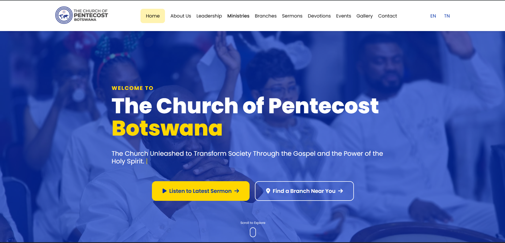
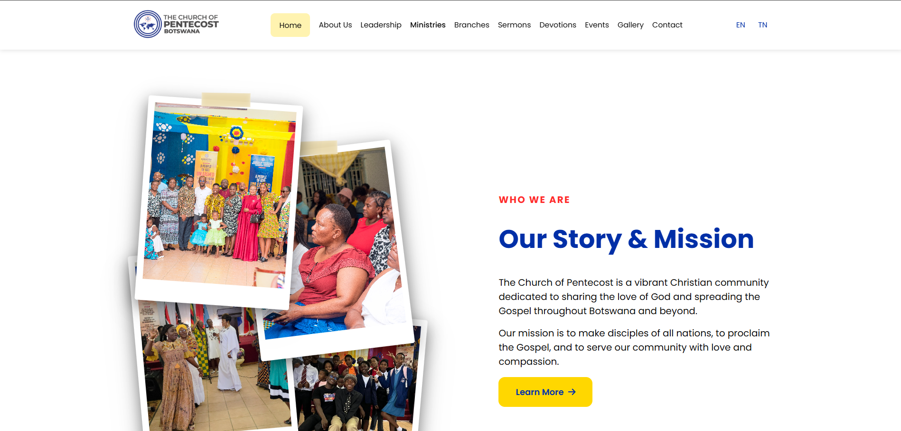
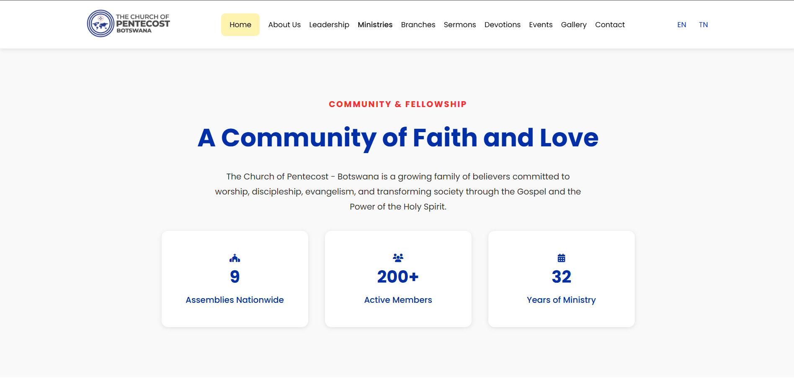
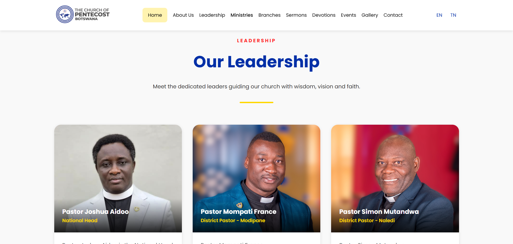
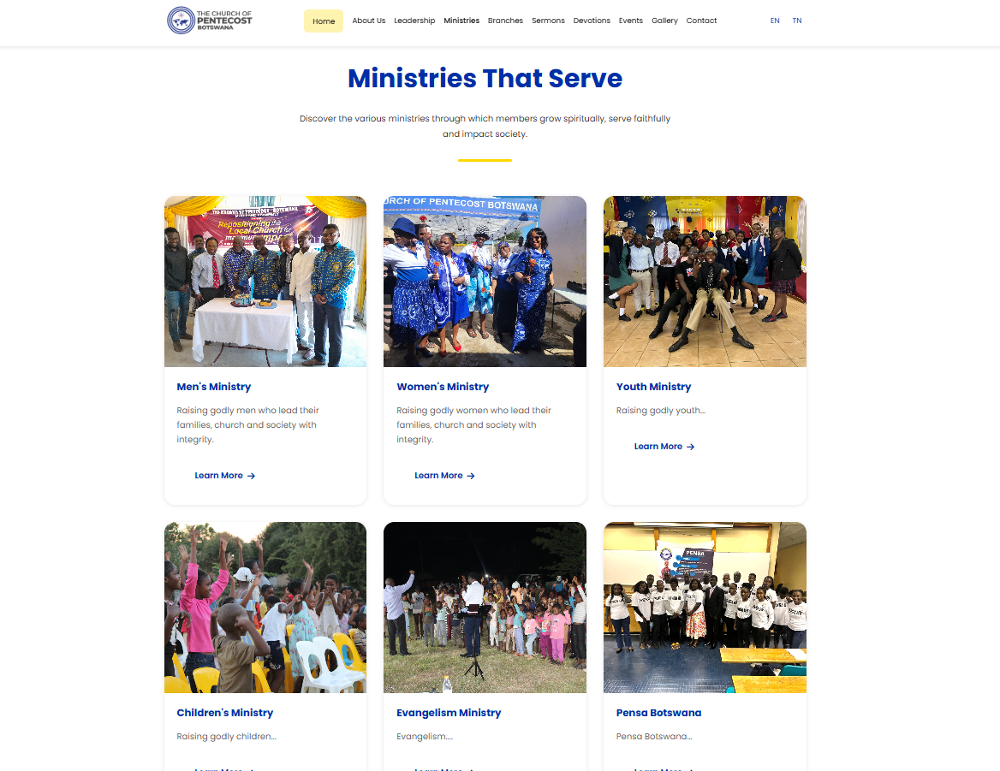
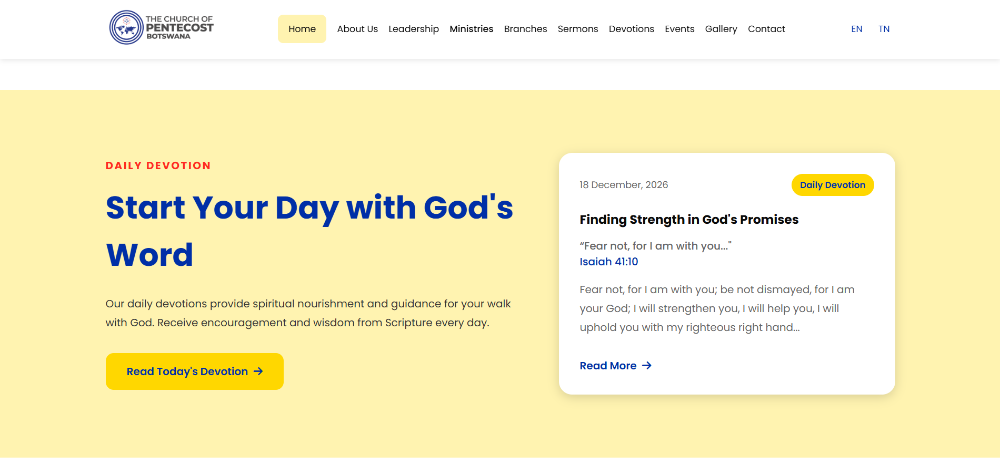
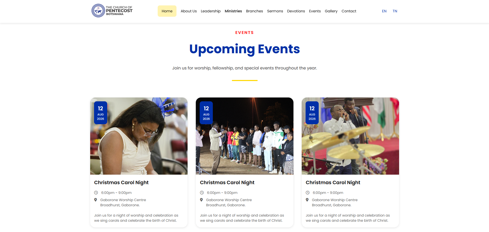
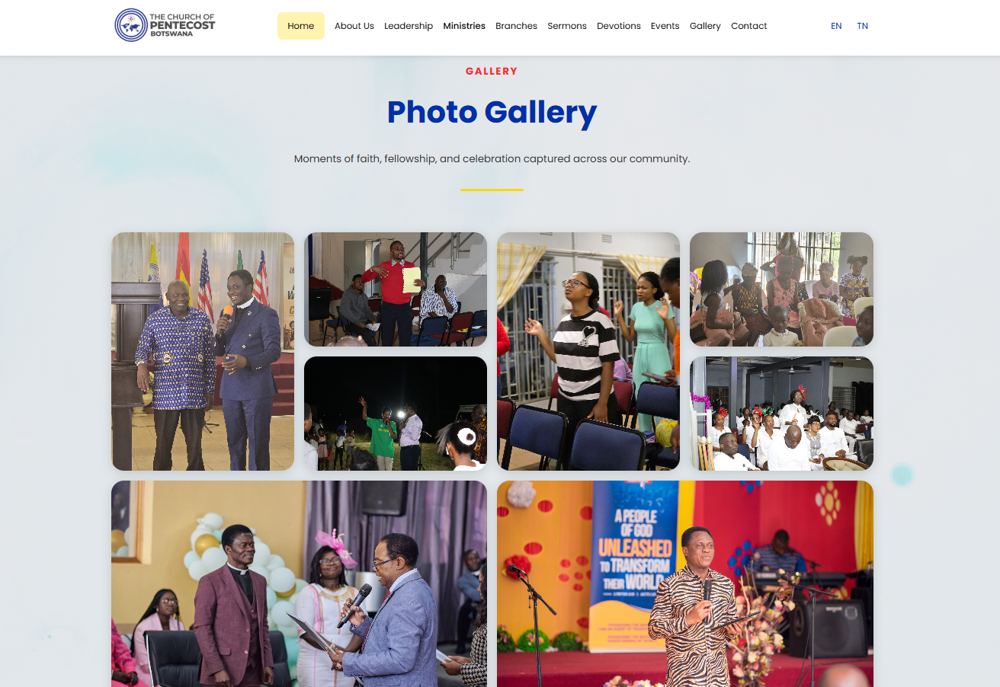
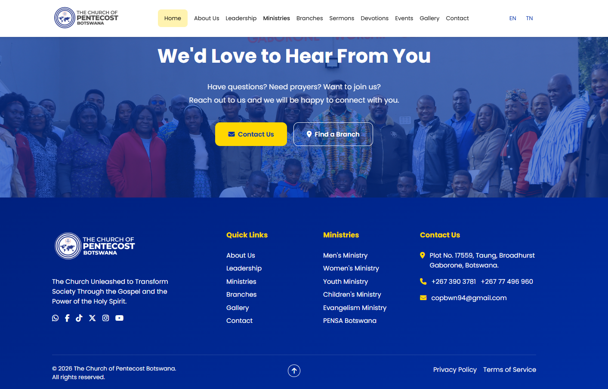

# ⛪ COP Botswana Showcase

<p align="center">

### Digital Transformation Through a Modern Church Website

Designing a scalable, accessible, and engaging digital platform for **The Church of Pentecost Botswana**.

</p>

---

<p align="center">


</p>

---

# 📖 Overview

COP Botswana Showcase documents the engineering process behind the development of the official website for **The Church of Pentecost Botswana**.

Rather than serving only as a code repository, this project demonstrates how software engineering principles were applied to design a modern, responsive, and scalable digital platform that improves communication, accessibility, and community engagement.

The repository presents the project's business analysis, requirements engineering, architecture, UI/UX decisions, engineering process, and long-term vision while keeping implementation details private.

---

# 📌 Executive Summary

As organisations increasingly rely on digital platforms to communicate with their communities, maintaining a professional and accessible online presence has become essential.

The Church of Pentecost Botswana required a modern website capable of presenting information clearly, supporting visitors, and providing members with easy access to ministries, leadership, events, sermons, devotions, and branch information.

This project applies software engineering practices to create a maintainable digital platform that supports the church's communication goals while providing a foundation for future digital services.

---

# 🚩 Business Problem

Prior to this project, church information could be difficult to discover or was distributed across multiple communication channels.

This created several challenges:

- Limited centralised online information
- Difficulty for first-time visitors to learn about the church
- Inconsistent access to events and ministry information
- Limited visibility of church branches
- No scalable platform for future digital services

These challenges highlighted the need for a modern, centralised digital platform.

---

# 🔄 Current Communication Journey

```text
Visitor Searches Online
          │
          ▼
Information Spread Across Multiple Sources
          │
          ▼
Limited Access to Church Information
          │
          ▼
Difficulty Finding Ministries, Events or Branches
```

---

# 💡 Proposed Solution

The website provides a central digital platform where visitors and members can access reliable, up-to-date information about the church.

Key capabilities include:

- Church information
- Leadership profiles
- Ministry information
- Church branches
- Events
- Sermons
- Daily devotions
- Gallery
- Contact information
- Future digital services

---

# ✨ Key Features

| Feature    | Description                                 |
| ---------- | ------------------------------------------- |
| Homepage   | Modern landing page introducing the church  |
| About      | Church history, vision, mission and beliefs |
| Leadership | National leadership information             |
| Ministries | Ministry overview and objectives            |
| Branches   | Church branch locations and contact details |
| Events     | Upcoming church events                      |
| Sermons    | Sermon information and future archive       |
| Devotions  | Daily devotional content                    |
| Gallery    | Church photo gallery                        |
| Contact    | Contact information with maps integration   |

---

# 👥 Target Users

| User Group            | Purpose                                                 |
| --------------------- | ------------------------------------------------------- |
| Visitors              | Learn about the church and locate branches              |
| Church Members        | Access events, sermons, devotions and announcements     |
| Church Leadership     | Communicate organisational information                  |
| Future Administrators | Manage website content through future CMS functionality |

---

# 🗂 Information Architecture

```text
Home
│
├── About
├── Leadership
├── Ministries
├── Branches
├── Events
├── Sermons
├── Devotions
├── Gallery
└── Contact
```

---

# 🏗 System Architecture

The current implementation follows a lightweight frontend architecture while remaining flexible for future platform expansion.

```text
Users
   │
   ▼
Responsive Frontend
   │
   ▼
HTML • CSS • JavaScript
   │
   ▼
Static Content
   │
   ▼
Google Maps Integration
```

Future versions will introduce APIs, content management capabilities, and dynamic services.

📄 **Further Reading:** [Architecture Documentation](docs/architecture.md)

---

# 💻 Technology Stack

| Layer                 | Technology      |
| --------------------- | --------------- |
| Frontend              | HTML5           |
| Styling               | CSS3            |
| Client-side Scripting | JavaScript      |
| Design                | Figma           |
| Graphics              | Adobe Photoshop |
| Maps                  | Google Maps     |
| Version Control       | Git & GitHub    |
| Documentation         | Markdown        |

The current version of the platform is intentionally built using **HTML5**, **CSS3**, and **Vanilla JavaScript** to deliver a fast, lightweight, and maintainable website while establishing the Church of Pentecost Botswana's official digital presence.

This approach enables members and visitors to access important church information early, while allowing the project team to validate the site's structure, gather feedback, and continuously improve the platform.

As the website matures and all planned pages and features are completed, the frontend is planned to gradually migrate to **React.js**. This transition will introduce a component-based architecture that improves scalability, code reusability, maintainability, and supports future capabilities such as dynamic content, API integrations, authentication, and member-focused digital services.

Further details on this technology strategy are available in the 📄[Technology Stack Documentation](docs/technology-stack.md).

---

# 🖼 UI Preview

The website has been designed with a strong emphasis on simplicity, accessibility, and responsive design.

Current interface includes:

- Hero Section
- Community Statistics
- About Preview
- Leadership Preview
- Ministries Preview
- Events Preview
- Gallery Preview
- Devotions Preview
- Contact Call-to-Action
- Footer

<p align="center">
  
</p>
<p align="center">
  
</p>
<p align="center">
  
</p>
<p align="center">
  
</p>
<p align="center">
  
</p>
<p align="center">
  
</p>
<p align="center">
  
</p>
<p align="center">
  
</p>
<p align="center">
  
</p>

---

# ⚙ Engineering Process

Rather than beginning directly with implementation, the project follows a structured software engineering process, progressing from planning and design into iterative development.

Completed phases include:

- ✅ Business Analysis
- ✅ Requirements Engineering
- ✅ Information Architecture
- ✅ Sitemap Design
- ✅ Wireframing
- ✅ UI/UX Design
- ✅ Design System
- ✅ Technical Planning
- ✅ Homepage (Version 1)

Current development focuses on:

- 🚧 Building remaining website pages
- 🚧 Implementing dynamic content
- 🚧 Bible API integration
- 🚧 Multi-language support (English / Setswana)

Quality assurance activities:

- ✅ Homepage testing
- ✅ Homepage performance optimisation
- ✅ Homepage SEO optimisation
- ✅ Homepage responsive optimisation

The remaining pages will undergo the same testing, optimisation, and quality assurance process once their implementation is complete.

📄 **Further Reading:** [Engineering Process](docs/engineering-process.md)

---

# 🧠 Challenges & Design Decisions

Some key engineering decisions included:

- Designing for both church members and first-time visitors.
- Organising large volumes of information into an intuitive navigation structure.
- Prioritising responsive design from the beginning.
- Building with future scalability in mind.
- Maintaining consistent church branding across all pages.
- Planning for a gradual transition from a static website to a modern web platform.

---

# 📈 Project Evolution

The website is being developed incrementally, with each release expanding its capabilities while maintaining a scalable architecture.

```text
Version 1
Responsive Website (HTML • CSS • JavaScript)
        │
        ▼
Version 2
Dynamic Content & API Integrations
        │
        ▼
Version 3
React.js Migration
        │
        ▼
Version 4
CMS & Member Services
        │
        ▼
Future
Digital Ministry Platform
```

Current development includes:

- Dynamic content
- Bible API integration
- Multi-language support
- Additional website pages
- Continued user experience improvements

Future platform enhancements include:

- Backend API
- Authentication
- Content Management System (CMS)
- Member & Leaders Portal
- Prayer Request Platform
- Event Registration
- React Migration

---

# 🚀 Project Roadmap

| Phase                             | Status         |
| --------------------------------- | -------------- |
| Business Analysis                 | ✅ Complete    |
| Requirements Engineering          | ✅ Complete    |
| Information Architecture          | ✅ Complete    |
| UI/UX Design                      | ✅ Complete    |
| Homepage Development              | ✅ Complete    |
| Homepage Testing                  | ✅ Complete    |
| Homepage Performance Optimisation | ✅ Complete    |
| Homepage SEO Optimisation         | ✅ Complete    |
| Homepage Responsive Optimisation  | ✅ Complete    |
| Remaining Website Pages           | 🚧 In Progress |
| Dynamic Content                   | 🚧 In Progress |
| Bible API Integration             | 🚧 In Progress |
| Multi-language Support            | 🚧 In Progress |
| Full Website Testing              | ⏳ Planned     |
| Full Performance Optimisation     | ⏳ Planned     |
| Full SEO Optimisation             | ⏳ Planned     |
| Full Responsive Optimisation      | ⏳ Planned     |

---

# 🔒 Repository Status

The implementation source code for the production website is intentionally maintained in a private repository.

This public repository serves as a software engineering case study documenting the planning, design decisions, architecture, and evolution of the project.

Documentation included in this repository covers:

- Business Analysis
- Requirements Engineering
- Information Architecture
- System Architecture
- Technology Stack
- UI/UX Design
- Engineering Process
- Lessons Learned
- Project Roadmap

---

# 📫 Contact

**Alexander Allotey-Bray**

Software Developer • Systems Analyst

---

<p align="center">

⭐ If you found this engineering case study valuable, consider giving the repository a star.

</p>
